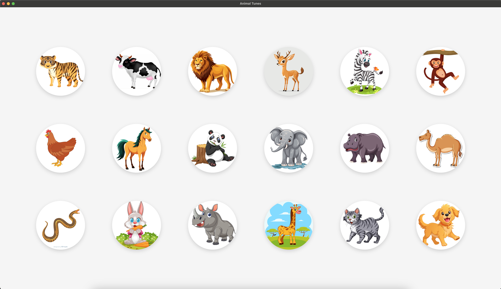

# Animal Tunes 🐾🎶

**Animal Tunes** is a fun, interactive piano-like application built using ElectronJS. It allows toddlers to press keys or click on animal icons, which then play corresponding animal sounds. It's an engaging way for children to learn about different animals while having fun!



## Features
- **18 Animal Sounds**: Each circle represents a different animal, and clicking or pressing a key triggers the corresponding sound.
- **Interactive UI**: The circles animate when clicked or when a key is pressed, providing a responsive experience.
- **Unique Key Bindings**: Multiple keys are assigned to each animal, making it easier for toddlers to explore the sounds.

## Technologies Used
- **ElectronJS**: For building the desktop application.
- **HTML/CSS/JavaScript**: For UI layout, styling, and interactivity.
- **Audio API**: To play animal sound effects.

## Installation
To run this application locally, follow these steps:

1. **Clone the repository**:
   ```bash
   git clone https://github.com/ashwyn222/animal-tunes.git
   cd animal-tunes
   ```

2. **Install dependencies**:
   Ensure you have [Node.js](https://nodejs.org/) installed, then run:
   ```bash
   npm install
   ```

3. **Run the application**:
   Start the Electron app:
   ```bash
   npm start
   ```

## How to Play
1. **Click**: Click on any of the animal circles to hear its sound.
2. **Key Press**: Press a key on your keyboard to trigger the sound associated with the corresponding animal.
   
   ### Key Bindings:
   Each animal has multiple keys assigned:
   - **Tiger**: `a`, `b`, `;`
   - **Cow**: `c`, `d`, `'`
   - **Lion**: `e`, `f`, `.` 
   - **Deer**: `g`, `h`, `/`
   - **Zebra**: `i`, `j`, `[`
   - **Monkey**: `k`, `l`, `]`
   - **Hen**: `m`, `n`
   - **Horse**: `o`, `p`
   - **Panda**: `q`, `r`
   - **Elephant**: `s`, `t`
   - **Hippo**: `u`, `v`
   - **Camel**: `w`, `x`
   - **Snake**: `y`, `z`
   - **Rabbit**: `0`, `1`
   - **Rhino**: `2`, `3`
   - **Giraffe**: `4`, `5`
   - **Cat**: `6`, `7`
   - **Dog**: `8`, `9`

## Sound Handling
- Only one sound can be played at a time. If a key is pressed while a sound is already playing, the new sound will wait until the current one finishes.
